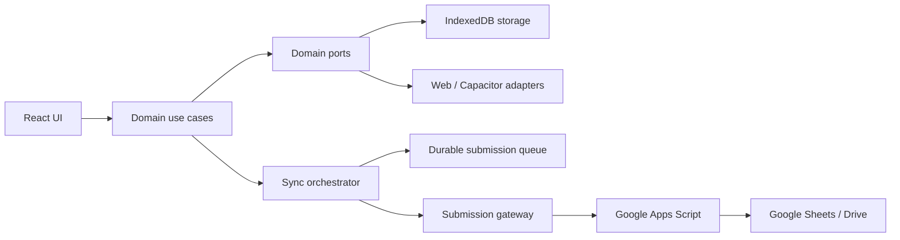

# VKU Field Survey

Offline-first campus equipment and facility inspection for the web and Android.

[Open the live PWA](https://vkufieldsurvey.vanhoang.online) · [Download Android APK](https://vkufieldsurvey.vanhoang.online/downloads/vku-field-survey.apk) · [Requirements](docs/assignment/REQUIREMENTS.md) · [Architecture](docs/architecture/ARCHITECTURE.md) · [Evidence](docs/evidence/README.md)


## Overview

VKU Field Survey helps university facility inspectors and field staff inspect and record campus equipment conditions anytime—even completely offline. Inspection drafts, captured photos, and GPS metadata are stored locally in IndexedDB. When network connectivity is restored, the unified synchronization orchestrator pushes queued items sequentially to Google Sheets, reconciles remote changes, and sends a branded notification upon successful sync.

The application runs seamlessly across:

- **Progressive Web App (PWA):** Installable, standalone, offline App Shell with service worker precaching.
- **Android Native App:** Packaged with Capacitor 8, integrating native Camera, GPS, Network, Local Notifications, and Capgo OTA auto-updater.
- **Desktop & Mobile Web:** Clean, responsive, compact product UI accessible from any modern browser.

The production PWA is deployed over HTTPS at [vkufieldsurvey.vanhoang.online](https://vkufieldsurvey.vanhoang.online).

---

## Core workflow

1. **Start Survey or Resume Draft:** Begin a new inspection or resume an automatically autosaved draft.
2. **Campus Zone & Room:** Select campus zone (`Khu Hàn` or `Khu Việt`) and enter building and room (auto-derived ID, e.g., `K.A-205`).
3. **Equipment Category & Rating:** Select category (Hardware, Projector, AC, Electrical, Furniture) and record a 1–5 condition rating.
4. **Defect Notes & Camera Photo:** Add notes and attach a photo (via native camera or file picker fallback).
5. **Live GPS & Interactive Map:** Capture high-accuracy GPS coordinates (latitude, longitude, altitude, accuracy) with an interactive OpenStreetMap preview.
6. **Offline Queueing:** Submit while online or offline. While offline, submissions stay securely in `PENDING_SYNC` without premature network errors.
7. **Auto-Sync on Reconnect:** When internet returns, the background orchestrator automatically syncs pending records to Google Sheets and sends a branded native notification.
8. **Cloud Reconciliation & Management:** View records categorized by recency, search/filter, inspect details, retry failed records, or manually sync with Google Sheets.
9. **Analytics & Statistics:** Analyze ratings, equipment coverage, zone breakdown, and actionable maintenance alerts.

---

## Features

### 📍 Field Survey & Geolocation
- **Mobile-first Survey Form:** Form fields tailored for fast one-handed data entry in the field.
- **Derived Room Identifiers:** Structured IDs like `K.A-205` derived without redundant database columns.
- **GPS Capture & Map Visualizer:** One-tap GPS acquisition with live coordinates, accuracy radius, and embedded interactive OpenStreetMap pinpoint card.
- **Photo Attachments:** Integrated camera capture with image compression and offline base64/blob storage.
- **Durable Draft Recovery:** Auto-saves drafts on every edit; survives browser refreshes, tab closures, and app restarts.

### 🔄 Offline-First & Two-Way Sync
- **IndexedDB Persistence:** Complete offline persistence for drafts, photos, and inspection queues via `idb`.
- **Durable Queue State Machine:** Strict transitions (`PENDING_SYNC` → `SYNCING` → `SYNCED` / `SYNC_FAILED`).
- **Offline Guard:** Prevents unnecessary network attempts when offline; protects queued records from false error states.
- **Auto-Sync on Network Reconnection:** Automatically detects network restoration (`ONLINE_EVENT`, `NATIVE_NETWORK_RECONNECT`) and syncs queued data in FIFO order.
- **Two-Way Cloud Reconciliation:** Syncs submissions upward to Google Sheets and reconciles remote changes (identifies records removed or added on Google Sheets).
- **At-Least-Once Delivery & Duplicate Protection:** Uses persistent UUIDs and positive acknowledgements to ensure zero data loss.

### 🔔 Branded Native Notifications
- **Status & Reconnect Alerts:** Dispatches local notifications when queued offline surveys are successfully uploaded.
- **Brand Identity:** Styled with official VKU logo (`ic_vku_notification`, `ic_vku_logo`) and brand color `#0054A6`.

### ⚡ Capgo OTA (Over-The-Air) Updates
- **Automatic App Updates:** Integrated `@capgo/capacitor-updater` enables instant background updates to the Android app without requiring a manual APK reinstall.
- **Seamless Deployment:** `npm run capgo:upload` deploys new web bundles to production devices via Capgo Cloud.

### 📊 Records & Analytics Dashboard
- **Grouped Records View:** Chronological grouping into Today, Yesterday, and Earlier.
- **Multi-criteria Filtering:** Filter by sync status, equipment category, zone, or poor condition flag.
- **Full Detail Inspection:** View timestamps, GPS coordinates, notes, full-size photos, and remote sync details.
- **Facility Statistics:** Average ratings, inspection status counters, and zone-by-zone distribution charts.

### 📱 PWA & Android Native Wrapper
- **PWA Capabilities:** Standalone manifest, service-worker App Shell precaching, and full offline reload capability.
- **Capacitor 8 Android Package:** Lightweight ~13.8 MB APK ready for Android 7.0+ devices ([Download APK](https://vkufieldsurvey.vanhoang.online/downloads/vku-field-survey.apk)).
- **Clean UI / Anti-Slop:** Streamlined layout, collapsible filters, unified action bar, and clear typography hierarchy.

## Technology stack

| Area               | Technology                                                        |
| ------------------ | ----------------------------------------------------------------- |
| UI                 | React 19, TypeScript 6                                            |
| Build              | Vite 8                                                            |
| PWA                | `vite-plugin-pwa`, Workbox, custom service worker                 |
| Persistence        | IndexedDB through `idb`                                           |
| Maps & Location    | Leaflet, OpenStreetMap, Geolocation Web / Capacitor APIs          |
| Native Android     | Capacitor 8 (Camera, Network, Local Notifications, Geolocation)   |
| OTA Updates        | Capgo (`@capgo/capacitor-updater`, Capgo Cloud)                   |
| Remote destination | Google Apps Script Web App and Google Sheets / Drive              |
| Testing            | Vitest, Testing Library, jsdom, fake-indexeddb                    |
| Static hosting     | Cloudflare Pages                                                  |

Dependency versions are locked in `package-lock.json`. Use `npm ci` for reproducible installation; do not upgrade packages solely because newer versions exist.

## Architecture

The approved architecture separates UI, use cases, persistence, platform APIs, and the remote destination:



Key invariants:

- UI components do not own durable persistence or backend transport.
- Web and native capabilities are accessed through platform adapters.
- Every retry trigger calls the same synchronization orchestration path.
- Network availability triggers a retry; it does not prove the destination is reachable.
- Unsynced data is never deleted because an attempt failed.
- `SYNCED` requires an explicit positive acknowledgement from the destination.

Read the frozen design in [ARCHITECTURE.md](docs/architecture/ARCHITECTURE.md), [DATA_FLOW.md](docs/architecture/DATA_FLOW.md), and [SYNC_FLOW.md](docs/architecture/SYNC_FLOW.md).

## Prerequisites

### Web development

- Node.js `24.20.0` (project baseline; pinned in `.nvmrc` and `.node-version`)
- npm 10 or a lockfile-compatible newer npm release
- A current browser with IndexedDB support

### Android development

- Java Development Kit 21
- Android Studio and Android SDK
- Android SDK Platform Tools (`adb`)
- An emulator or USB-debuggable Android device

## Quick start

```powershell
git clone https://github.com/Vcoch27/vku-field-survey.git
cd vku-field-survey

# Use the pinned Node 24 baseline when nvm is available.
nvm use

# Create a local environment file. Do not commit it.
Copy-Item .env.example .env.local

# Install exactly the locked dependency graph and start Vite.
npm ci
npm run dev
```

Open the local URL printed by Vite, normally `http://localhost:5173`.

The app can be developed and exercised offline without a submission endpoint, but remote synchronization cannot complete. Queued data remains local until a valid endpoint is configured and acknowledges it.

## Environment configuration

Copy `.env.example` to `.env.local` and set only the values needed for your environment:

| Variable                       | Required                      | Purpose                                                                   |
| ------------------------------ | ----------------------------- | ------------------------------------------------------------------------- |
| `VITE_SUBMISSION_ENDPOINT`     | Required for real remote sync | HTTPS URL of the deployed Google Apps Script Web App                      |
| `VITE_SUBMISSION_CLIENT_TOKEN` | Optional                      | Lightweight anti-accidental-abuse token matching the Apps Script property |

Example:

```dotenv
VITE_SUBMISSION_ENDPOINT=https://script.google.com/macros/s/DEPLOYMENT_ID/exec
VITE_SUBMISSION_CLIENT_TOKEN=
```

All `VITE_*` values are embedded in client-side assets and are publicly inspectable. Never put private keys, OAuth secrets, service-account credentials, or confidential tokens in these variables. The optional client token is not authentication and must not be treated as a secret.

For the spreadsheet schema, Apps Script deployment, Script Properties, and Cloudflare configuration, follow [Google Sheets Backend Integration & Setup](docs/deployment/GOOGLE-SHEETS-BACKEND-SETUP.md). The backend source is in [`google-apps-script/Code.gs`](google-apps-script/Code.gs).

## Available commands

| Command                 | Purpose                                                               |
| ----------------------- | --------------------------------------------------------------------- |
| `npm run dev`           | Start the Vite development server                                     |
| `npm run typecheck`     | Type-check application and build configuration                        |
| `npm run lint`          | Run ESLint across the repository                                      |
| `npm run test -- --run` | Run the Vitest suite once                                             |
| `npm run test`          | Run Vitest in watch mode                                              |
| `npm run build`         | Type-check and create the production bundle in `dist/`                |
| `npm run preview`       | Serve the production bundle locally                                   |
| `npm run capgo:upload`  | Build and upload live OTA bundle to Capgo Cloud for instant app update|

Before opening a pull request or publishing a build, run:

```powershell
npm run typecheck
npm run lint
npm run test -- --run
npm run build
git diff --check
```

The test suite includes unit tests across domain logic, IndexedDB storage, PWA sync handler, native notification adapters, and UI components.

## Testing the production PWA locally

```powershell
npm run build
npm run preview
```

Use the preview URL printed by Vite. Installability and service-worker behavior require a secure context; `localhost` is accepted by modern browsers for local development. To verify offline boot, load the production build once while online, confirm the service worker controls the page, switch the browser offline, and reload.

## Over-The-Air (OTA) Updates

VKU Field Survey supports instant, background Over-The-Air updates on Android via **Capgo**:

```powershell
# Upload latest build directly to Capgo Cloud production channel
npm run capgo:upload
```

When users open the app on Android, the `@capgo/capacitor-updater` plugin downloads and applies the latest bundle seamlessly in the background—no APK re-download or reinstall necessary!

## Android build and installation

Build the web assets and synchronize them into the existing Android project:

```powershell
npm ci
npm run build
npx cap sync android
```

Create a release/debug APK with the checked-in Gradle wrapper:

```powershell
Set-Location android
$env:JAVA_HOME = "C:\Program Files\Java\jdk-21"
$env:GRADLE_USER_HOME = "$env:USERPROFILE\.gradle"
.\gradlew.bat assembleDebug
Set-Location ..
```

The generated APK is located at:

```text
android/app/build/outputs/apk/debug/app-debug.apk
```

Install and launch it on a connected device:

```powershell
adb devices
adb -s <DEVICE_ID> install -r ".\android\app\build\outputs\apk\debug\app-debug.apk"
adb -s <DEVICE_ID> shell am start -n com.vku.fieldsurvey/.MainActivity
```

Pre-built package: [vku-field-survey.apk](https://vkufieldsurvey.vanhoang.online/downloads/vku-field-survey.apk) (~13.8 MB, Android 7.0+).

## Cloudflare Pages deployment

Use these build settings:

| Setting                | Value                                            |
| ---------------------- | ------------------------------------------------ |
| Repository             | `Vcoch27/vku-field-survey`                       |
| Production branch      | `main`                                           |
| Framework preset       | Vite or None                                     |
| Build command          | `npm run build`                                  |
| Build output directory | `dist`                                           |
| Root directory         | `/`                                              |
| Node version           | Read from `.node-version` / `.nvmrc` (`24.20.0`) |

Set `VITE_SUBMISSION_ENDPOINT` in the Cloudflare production environment when the deployed app must synchronize to Google Sheets. Set `VITE_SUBMISSION_CLIENT_TOKEN` only if the matching Apps Script property is configured. Trigger a new deployment after changing either value because Vite embeds them at build time.

The current custom domain is [https://vkufieldsurvey.vanhoang.online](https://vkufieldsurvey.vanhoang.online). Deployment and production verification notes are recorded in [M9.1 Deployment Evidence](docs/deployment/M9.1-DEPLOYMENT-EVIDENCE.md).

## Repository structure

```text
.
|-- .agents/                 Shared agent rules, skills, and role definitions
|-- android/                 Existing Capacitor Android project
|-- docs/
|   |-- acceptance/          Acceptance contracts by quality area
|   |-- architecture/        Frozen architecture and ADRs
|   |-- assignment/          Assignment requirements and report template
|   |-- deployment/          Backend and deployment runbooks
|   |-- evidence/            Verification registry and screenshots
|   |-- implementation/      Toolchain, milestones, and workstreams
|   `-- research/            Sources, risks, compatibility, and open questions
|-- google-apps-script/      Google Sheets destination implementation
|-- public/                  PWA icons and static assets
|-- scripts/                 Approved verification and diagnostic scripts
|-- src/
|   |-- app/                 Application shell, routing, and composition
|   |-- data/                IndexedDB schema and storage implementation
|   |-- domain/              Models, ports, validation, and use cases
|   |-- features/            Home, Survey, Records, Details, and Statistics UI
|   |-- platform/            Web, Capacitor, PWA, network, camera, and gateway adapters
|   `-- styles/              Shared application styling
|-- AGENTS.md                Engineering contract for humans and agents
|-- capacitor.config.ts      Capacitor application configuration
|-- package-lock.json        Reproducible npm dependency lockfile
|-- package.json             Scripts and dependency manifest
`-- vite.config.ts           Vite, Vitest, and PWA build configuration
```

Generated `dist/`, installed `node_modules/`, local `.env*` files, and machine-specific Android configuration must not be committed.

## Documentation map

- [Assignment requirements](docs/assignment/REQUIREMENTS.md)
- [Acceptance criteria](docs/assignment/ACCEPTANCE_CRITERIA.md)
- [Report template](docs/assignment/REPORT_TEMPLATE.md)
- [Architecture](docs/architecture/ARCHITECTURE.md)
- [Implementation plan](docs/implementation/IMPLEMENTATION_PLAN.md)
- [Toolchain matrix](docs/implementation/TOOLCHAIN_MATRIX.md)
- [Open questions](docs/research/OPEN_QUESTIONS.md)
- [Google Sheets setup](docs/deployment/GOOGLE-SHEETS-BACKEND-SETUP.md)
- [Evidence registry](docs/evidence/README.md)
- [Engineering contract](AGENTS.md)

Assignment material, approved human decisions, and acceptance criteria remain the source of truth. Documentation can contain historical open questions; do not silently reinterpret them as new product requirements.

## Data and security notes

- Survey drafts, photos, and queued submissions persist on the local device until application actions remove them or browser/device storage is cleared.
- Clearing site data, uninstalling the Android app, or operating-system storage eviction can remove local-only records.
- The client endpoint and any `VITE_*` value are public by design.
- Do not commit `.env`, credentials, production spreadsheet identifiers, tokens, exported survey data, or identifiable field photos.
- A network-online signal starts a retry but cannot guarantee that Google Apps Script or Google Sheets is reachable.

## Troubleshooting

### `npm ci` reports `EBADENGINE`

Run `node --version` and switch to the pinned Node `24.20.0` baseline with your Node version manager before reinstalling.

### Submissions remain pending

Confirm that `VITE_SUBMISSION_ENDPOINT` was present when the app was built, the Apps Script deployment is accessible, and its response includes the expected positive acknowledgement. Connectivity alone is not success, and the app intentionally retains unacknowledged data.

### Android build cannot find Java or the SDK

Confirm JDK 21, `JAVA_HOME`, the Android SDK, and `android/local.properties`. When a machine-level Gradle cache path is invalid, set `GRADLE_USER_HOME` to a writable user directory as shown above.

### Camera behavior differs between browser and Android

The browser uses its web camera/file input adapter; Android uses `@capacitor/camera`. Verify permissions on the target platform and test cancellation as well as successful capture.

## Contributing

Read [AGENTS.md](AGENTS.md) before changing the repository. Work on a task-scoped branch, map work to approved requirements and acceptance IDs, keep commits focused, avoid unrelated changes, and attach current verification evidence. A feature is not complete merely because code was written.

## License

No license file is currently included. Contact the repository owner before copying, redistributing, or reusing the project.
