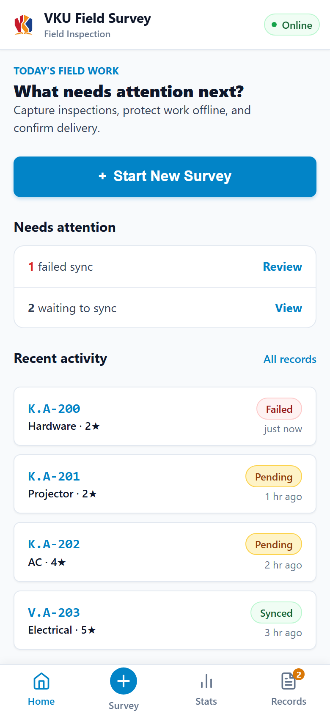
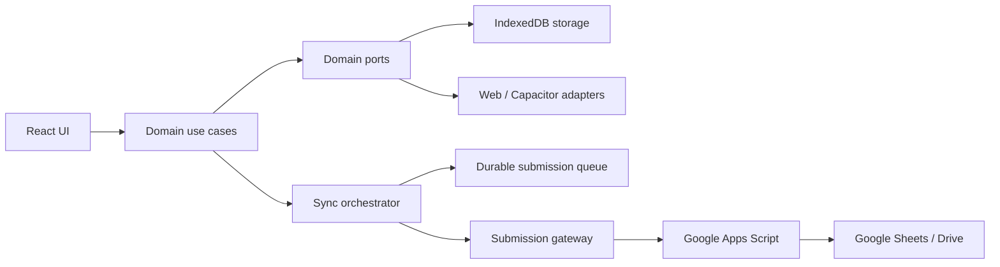

# VKU Field Survey

Offline-first campus equipment and facility inspection for the web and Android.

[Open the live PWA](https://vkufieldsurvey.vanhoang.online) · [Requirements](docs/assignment/REQUIREMENTS.md) · [Architecture](docs/architecture/ARCHITECTURE.md) · [Evidence](docs/evidence/README.md)



## Overview

VKU Field Survey helps field staff record campus equipment conditions even when connectivity is unavailable. Drafts and queued submissions are stored locally in IndexedDB. When connectivity returns, one synchronization use case processes the durable queue sequentially and only marks a record as synced after a positive acknowledgement from the configured destination.

The same React application is delivered as:

- an installable, standalone Progressive Web App (PWA);
- an Android application packaged with Capacitor;
- a responsive browser application for desktop and mobile.

The public deployment is served over HTTPS at [vkufieldsurvey.vanhoang.online](https://vkufieldsurvey.vanhoang.online). The deployed site represents the latest build published from the configured production branch.

## Core workflow

1. Start a survey or resume an automatically saved draft.
2. Select campus zone (`K` or `V`) and enter the building and room number.
3. Select an equipment category: Hardware, Projector, AC, Electrical, or Furniture.
4. Record a 1-5 star condition rating, defect notes, and a camera photo.
5. Submit while online or offline. The record is durably queued on the device.
6. Review its status in Records and retry items that need attention.
7. Use Statistics to inspect ratings, equipment coverage, campus-zone coverage, and actionable follow-up items.

## Features

### Field survey

- Mobile-first survey form with location, category, rating, notes, and photo capture.
- Derived room identifiers such as `K.A-205` without redundant persisted state.
- Automatic draft persistence after meaningful changes.
- Draft recovery after refresh and, while platform storage remains available, browser or app restart.
- Web file-camera fallback and native Capacitor Camera integration.

### Offline-first data and synchronization

- IndexedDB-backed drafts, photos, and submission queue through `idb`.
- Durable queue states: `PENDING_SYNC`, `SYNCING`, `SYNCED`, and `SYNC_FAILED`.
- UUID and timestamp on every queued submission.
- Sequential dispatch with durable claiming to avoid concurrent duplicate processing.
- Retry triggers for browser connectivity changes, supported Background Sync, application startup/resume, and native network changes.
- Failed or unacknowledged submissions retain their local data.
- Positive backend acknowledgement is required before a record becomes `SYNCED`.

### Records and statistics

- Records grouped into Today, Yesterday, and Earlier.
- Filtering by sync status, category, campus zone, and poor condition.
- Newest/oldest sorting, full record details, contextual actions, and photo access.
- Total survey count, average rating, and synchronization progress.
- Rating, category, and campus-zone distributions.
- Deterministic insights with drill-down links into the relevant records.

### PWA and Android

- Installable manifest with standalone display, responsive 192x192 and 512x512 icons, and VKU theme color `#0284C7`.
- Service-worker App Shell precaching and offline boot/reload support.
- Capacitor Android wrapper with Camera, Network, and App lifecycle plugins.
- Responsive layouts verified from narrow mobile widths through desktop widths.

## Technology stack

| Area | Technology |
| --- | --- |
| UI | React 19, TypeScript 6 |
| Build | Vite 8 |
| PWA | `vite-plugin-pwa`, Workbox, custom service worker |
| Persistence | IndexedDB through `idb` |
| Native | Capacitor 8, Camera, Network, and App plugins |
| Remote destination | Google Apps Script Web App and Google Sheets |
| Testing | Vitest, Testing Library, jsdom, fake-indexeddb |
| Static hosting | Cloudflare Pages |

Dependency versions are locked in `package-lock.json`. Use `npm ci` for reproducible installation; do not upgrade packages solely because newer versions exist.

## Architecture

The approved architecture separates UI, use cases, persistence, platform APIs, and the remote destination:



Key invariants:

- UI components do not own durable persistence or backend transport.
- Web and native capabilities are accessed through platform adapters.
- Every retry trigger calls the same synchronization orchestration path.
- Network availability triggers a retry; it does not prove the destination is reachable.
- Unsynced data is never deleted because an attempt failed.
- `SYNCED` requires an explicit positive acknowledgement from the destination.

Read the frozen design in [ARCHITECTURE.md](docs/architecture/ARCHITECTURE.md), [DATA_FLOW.md](docs/architecture/DATA_FLOW.md), and [SYNC_FLOW.md](docs/architecture/SYNC_FLOW.md).

## Prerequisites

### Web development

- Node.js `24.20.0` (project baseline; pinned in `.nvmrc` and `.node-version`)
- npm 10 or a lockfile-compatible newer npm release
- A current browser with IndexedDB support

### Android development

- Java Development Kit 21
- Android Studio and Android SDK
- Android SDK Platform Tools (`adb`)
- An emulator or USB-debuggable Android device

## Quick start

```powershell
git clone https://github.com/Vcoch27/vku-field-survey.git
cd vku-field-survey

# Use the pinned Node 24 baseline when nvm is available.
nvm use

# Create a local environment file. Do not commit it.
Copy-Item .env.example .env.local

# Install exactly the locked dependency graph and start Vite.
npm ci
npm run dev
```

Open the local URL printed by Vite, normally `http://localhost:5173`.

The app can be developed and exercised offline without a submission endpoint, but remote synchronization cannot complete. Queued data remains local until a valid endpoint is configured and acknowledges it.

## Environment configuration

Copy `.env.example` to `.env.local` and set only the values needed for your environment:

| Variable | Required | Purpose |
| --- | --- | --- |
| `VITE_SUBMISSION_ENDPOINT` | Required for real remote sync | HTTPS URL of the deployed Google Apps Script Web App |
| `VITE_SUBMISSION_CLIENT_TOKEN` | Optional | Lightweight anti-accidental-abuse token matching the Apps Script property |

Example:

```dotenv
VITE_SUBMISSION_ENDPOINT=https://script.google.com/macros/s/DEPLOYMENT_ID/exec
VITE_SUBMISSION_CLIENT_TOKEN=
```

All `VITE_*` values are embedded in client-side assets and are publicly inspectable. Never put private keys, OAuth secrets, service-account credentials, or confidential tokens in these variables. The optional client token is not authentication and must not be treated as a secret.

For the spreadsheet schema, Apps Script deployment, Script Properties, and Cloudflare configuration, follow [Google Sheets Backend Integration & Setup](docs/deployment/GOOGLE-SHEETS-BACKEND-SETUP.md). The backend source is in [`google-apps-script/Code.gs`](google-apps-script/Code.gs).

## Available commands

| Command | Purpose |
| --- | --- |
| `npm run dev` | Start the Vite development server |
| `npm run typecheck` | Type-check application and build configuration |
| `npm run lint` | Run ESLint across the repository |
| `npm run test -- --run` | Run the Vitest suite once |
| `npm run test` | Run Vitest in watch mode |
| `npm run build` | Type-check and create the production bundle in `dist/` |
| `npm run preview` | Serve the production bundle locally |

Before opening a pull request or publishing a build, run:

```powershell
npm run typecheck
npm run lint
npm run test -- --run
npm run build
git diff --check
```

The M9.1.8 evidence baseline records 179 passing tests across 31 files, responsive checks at 320, 360, 390, 430, 768, and 1280 px, a successful Capacitor sync, a successful Android debug build, and APK installation/launch on a physical Android device. See the [evidence registry](docs/evidence/README.md) for limitations and artifacts. Re-run the checks for the commit you intend to release; historical evidence is not a substitute for current verification.

## Testing the production PWA locally

```powershell
npm run build
npm run preview
```

Use the preview URL printed by Vite. Installability and service-worker behavior require a secure context; `localhost` is accepted by modern browsers for local development. To verify offline boot, load the production build once while online, confirm the service worker controls the page, switch the browser offline, and reload.

If a stale local service worker obscures a development change, clear the site's storage or unregister the worker in browser developer tools, then reload. Do not use this as a production update strategy.

## Android build and installation

Build the web assets and synchronize them into the existing Android project:

```powershell
npm ci
npm run build
npx cap sync android
```

Create a debug APK with the checked-in Gradle wrapper:

```powershell
Set-Location android
$env:JAVA_HOME = "C:\Program Files\Java\jdk-21"
$env:GRADLE_USER_HOME = "$env:USERPROFILE\.gradle"
.\gradlew.bat assembleDebug
Set-Location ..
```

The generated APK is:

```text
android/app/build/outputs/apk/debug/app-debug.apk
```

Install and launch it on a connected device:

```powershell
adb devices
adb -s <DEVICE_ID> install -r ".\android\app\build\outputs\apk\debug\app-debug.apk"
adb -s <DEVICE_ID> shell monkey -p com.vku.fieldsurvey -c android.intent.category.LAUNCHER 1
```

The Capacitor application ID is `com.vku.fieldsurvey`, and `dist/` is the configured native web asset directory. `android/local.properties` is machine-specific and must remain untracked.

## Cloudflare Pages deployment

Use these build settings:

| Setting | Value |
| --- | --- |
| Repository | `Vcoch27/vku-field-survey` |
| Production branch | `main` |
| Framework preset | Vite or None |
| Build command | `npm run build` |
| Build output directory | `dist` |
| Root directory | `/` |
| Node version | Read from `.node-version` / `.nvmrc` (`24.20.0`) |

Set `VITE_SUBMISSION_ENDPOINT` in the Cloudflare production environment when the deployed app must synchronize to Google Sheets. Set `VITE_SUBMISSION_CLIENT_TOKEN` only if the matching Apps Script property is configured. Trigger a new deployment after changing either value because Vite embeds them at build time.

The current custom domain is [https://vkufieldsurvey.vanhoang.online](https://vkufieldsurvey.vanhoang.online). Deployment and production verification notes are recorded in [M9.1 Deployment Evidence](docs/deployment/M9.1-DEPLOYMENT-EVIDENCE.md).

## Repository structure

```text
.
|-- .agents/                 Shared agent rules, skills, and role definitions
|-- android/                 Existing Capacitor Android project
|-- docs/
|   |-- acceptance/          Acceptance contracts by quality area
|   |-- architecture/        Frozen architecture and ADRs
|   |-- assignment/          Assignment requirements and report template
|   |-- deployment/          Backend and deployment runbooks
|   |-- evidence/            Verification registry and screenshots
|   |-- implementation/      Toolchain, milestones, and workstreams
|   `-- research/            Sources, risks, compatibility, and open questions
|-- google-apps-script/      Google Sheets destination implementation
|-- public/                  PWA icons and static assets
|-- scripts/                 Approved verification and diagnostic scripts
|-- src/
|   |-- app/                 Application shell, routing, and composition
|   |-- data/                IndexedDB schema and storage implementation
|   |-- domain/              Models, ports, validation, and use cases
|   |-- features/            Home, Survey, Records, Details, and Statistics UI
|   |-- platform/            Web, Capacitor, PWA, network, camera, and gateway adapters
|   `-- styles/              Shared application styling
|-- AGENTS.md                Engineering contract for humans and agents
|-- capacitor.config.ts      Capacitor application configuration
|-- package-lock.json        Reproducible npm dependency lockfile
|-- package.json             Scripts and dependency manifest
`-- vite.config.ts           Vite, Vitest, and PWA build configuration
```

Generated `dist/`, installed `node_modules/`, local `.env*` files, and machine-specific Android configuration must not be committed.

## Documentation map

- [Assignment requirements](docs/assignment/REQUIREMENTS.md)
- [Acceptance criteria](docs/assignment/ACCEPTANCE_CRITERIA.md)
- [Report template](docs/assignment/REPORT_TEMPLATE.md)
- [Architecture](docs/architecture/ARCHITECTURE.md)
- [Implementation plan](docs/implementation/IMPLEMENTATION_PLAN.md)
- [Toolchain matrix](docs/implementation/TOOLCHAIN_MATRIX.md)
- [Open questions](docs/research/OPEN_QUESTIONS.md)
- [Google Sheets setup](docs/deployment/GOOGLE-SHEETS-BACKEND-SETUP.md)
- [Evidence registry](docs/evidence/README.md)
- [Engineering contract](AGENTS.md)

Assignment material, approved human decisions, and acceptance criteria remain the source of truth. Documentation can contain historical open questions; do not silently reinterpret them as new product requirements.

## Data and security notes

- Survey drafts, photos, and queued submissions persist on the local device until application actions remove them or browser/device storage is cleared.
- Clearing site data, uninstalling the Android app, or operating-system storage eviction can remove local-only records.
- The client endpoint and any `VITE_*` value are public by design.
- Do not commit `.env`, credentials, production spreadsheet identifiers, tokens, exported survey data, or identifiable field photos.
- A network-online signal starts a retry but cannot guarantee that Google Apps Script or Google Sheets is reachable.

## Troubleshooting

### `npm ci` reports `EBADENGINE`

Run `node --version` and switch to the pinned Node `24.20.0` baseline with your Node version manager before reinstalling.

### Submissions remain pending

Confirm that `VITE_SUBMISSION_ENDPOINT` was present when the app was built, the Apps Script deployment is accessible, and its response includes the expected positive acknowledgement. Connectivity alone is not success, and the app intentionally retains unacknowledged data.

### Android build cannot find Java or the SDK

Confirm JDK 21, `JAVA_HOME`, the Android SDK, and `android/local.properties`. When a machine-level Gradle cache path is invalid, set `GRADLE_USER_HOME` to a writable user directory as shown above.

### Camera behavior differs between browser and Android

The browser uses its web camera/file input adapter; Android uses `@capacitor/camera`. Verify permissions on the target platform and test cancellation as well as successful capture.

## Contributing

Read [AGENTS.md](AGENTS.md) before changing the repository. Work on a task-scoped branch, map work to approved requirements and acceptance IDs, keep commits focused, avoid unrelated changes, and attach current verification evidence. A feature is not complete merely because code was written.

## License

No license file is currently included. Contact the repository owner before copying, redistributing, or reusing the project.
