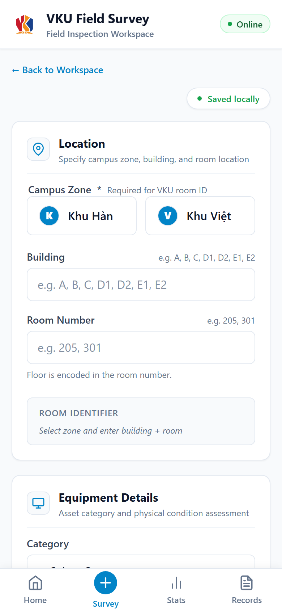
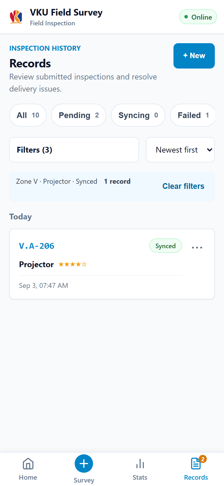
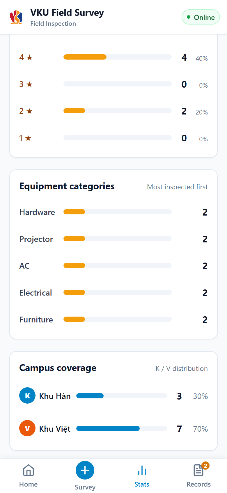
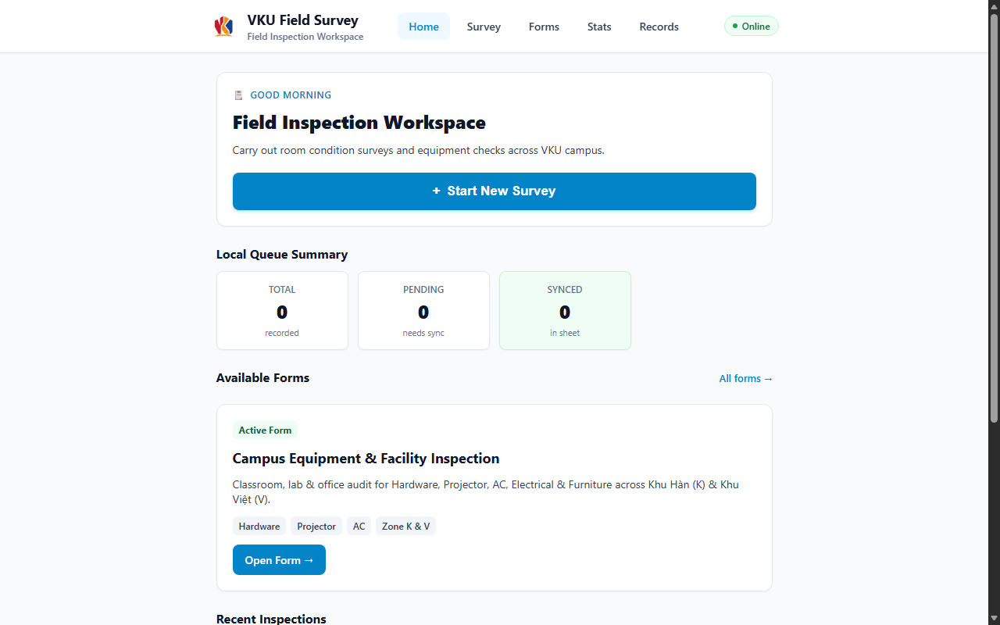
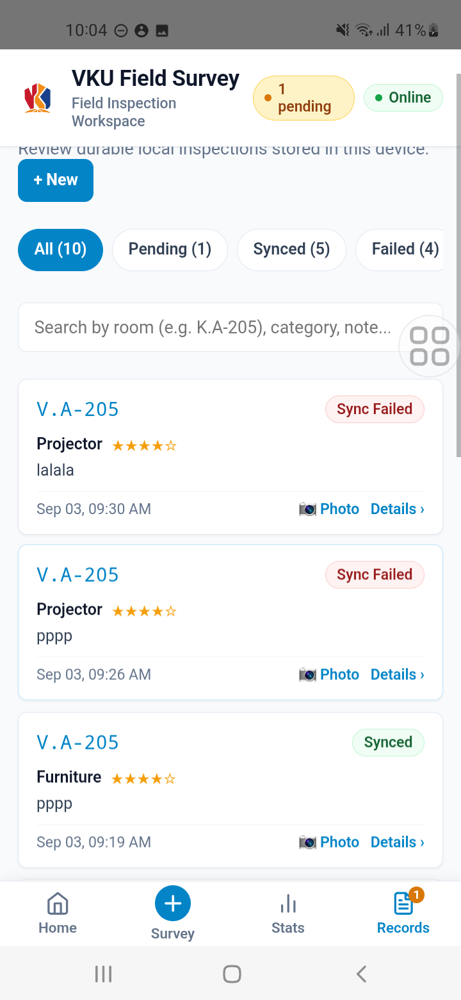
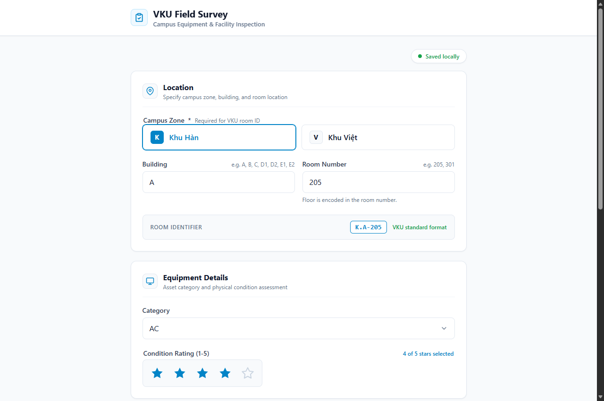
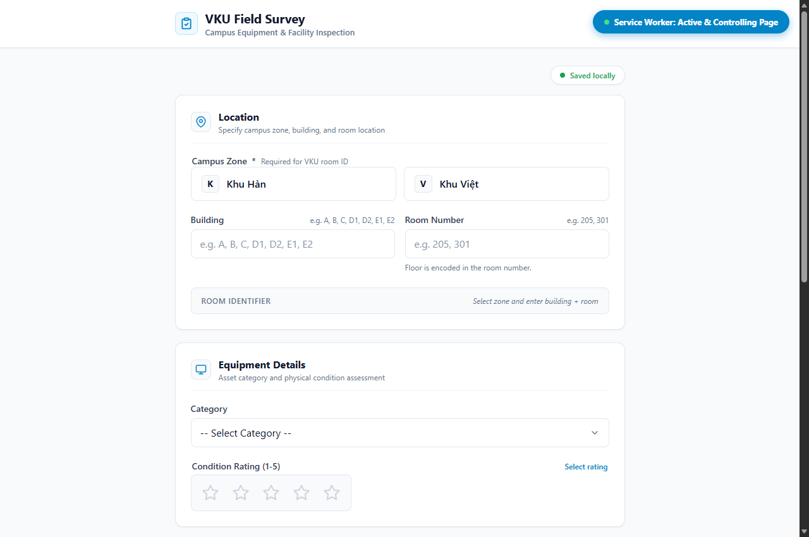

# MINI-PROJECT SHORT TECHNICAL REPORT

**Course:** Cross-Platform Mobile App Development (VKU)
**Mini-Project Title:** Mini-Project 1.2 — VKU Field Survey
**Team / Student Name:** Nguyen Van Hoang
**Submission Date:** 11/09/2026

---

| Resource | Link |
|---|---|
| GitHub Repository | https://github.com/Vcoch27/vku-field-survey |
| Live PWA | https://vkufieldsurvey.vanhoang.online/ |
| Download APK | https://vkufieldsurvey.vanhoang.online/downloads/vku-field-survey.apk |
| Demo Video | https://youtube.com/shorts/_c3UADYojTs |

---

## 1. PROJECT OVERVIEW

**VKU Field Survey** is an offline-first campus facility inspection application built with React + TypeScript, packaged as both a Progressive Web App (PWA) and a native Android app via Capacitor 8.

Inspectors can record equipment condition, capture photos via native camera, tag GPS coordinates, and submit reports — entirely offline. When connectivity is restored, a synchronization orchestrator pushes queued submissions sequentially to Google Sheets, reconciles remote changes (two-way sync), and sends a branded VKU notification on success.

---

## 2. FEATURE IMPLEMENTATION CHECKLIST

| # | Required Feature | Status | Implementation Details & Acceptance Level |
|:---:|---|:---:|---|
| 1 | Responsive Mobile Viewport | ✅ Complete | 100% responsive across mobile viewports; compact product UI on all screen sizes. Dark mode supported via Tailwind `dark:` classes. |
| 2 | Local Offline Persistence | ✅ Complete | Inspection drafts, submitted records, and sync state stored in **IndexedDB** via `SurveyStoragePort` abstraction. Records carry `PENDING_SYNC`, `SYNCED`, or `SYNC_FAILED` status. |
| 3 | Automatic Background Sync | ✅ Complete | `SyncOrchestrator` runs on: app mount when online, network reconnect event, PWA Background Sync API, and Capacitor `networkStatusChange`. Offline guard prevents premature `SYNC_FAILED` — records stay `PENDING_SYNC` until connectivity confirmed. |
| 4 | GPS Geolocation | ✅ Complete | Captures latitude, longitude, altitude, and accuracy via `@capacitor/geolocation` (native) with browser Geolocation API fallback. Interactive **OpenStreetMap / Leaflet** map embedded in survey form. |
| 5 | Native Camera Integration | ✅ Complete | `@capacitor/camera` on Android; fallback to `<input type="file" accept="image/*" capture>` on web. Photos Base64-encoded and stored locally. |
| 6 | Two-Way Cloud Reconciliation | ✅ Complete | After uploading `PENDING_SYNC` records to Google Sheets, orchestrator fetches full remote dataset and merges with local storage. Remote-only records are imported. |
| 7 | Native Local Notifications | ✅ Complete | `@capacitor/local-notifications` fires branded VKU notification on sync success. Android icon: `ic_vku_notification` (drawable), color: `#0054a6`. Web Notification API fallback. |
| 8 | OTA Auto-Update (Capgo) | ✅ Complete | `@capgo/capacitor-updater` checks Capgo Cloud on each launch and applies new JS bundles silently. Current channel: production. |
| 9 | PWA Installability | ✅ Complete | Valid `manifest.webmanifest`, service worker App Shell precache via Vite PWA plugin. Passes Chrome Lighthouse PWA audit. |
| 10 | Autosave Draft | ✅ Complete | Survey form debounce-saves to IndexedDB on every field change. Navigating away and returning restores last draft automatically. |

---

## 3. TECHNICAL ARCHITECTURE & PROJECT STRUCTURE

### Architecture Pattern: Clean Architecture (Layered)

```
+------------------------------------------------+
|  UI Layer  (src/features/, src/components/)    |
|  React + Tailwind CSS, Zustand UI state        |
+------------------------------------------------+
|  Application Layer  (src/app/, src/domain/)    |
|  Use cases, SyncOrchestrator, ports/contracts  |
+------------------------------------------------+
|  Infrastructure Layer  (src/platform/)         |
|  IndexedDB adapter, Google Sheets gateway,     |
|  Capacitor adapters (GPS, Camera, Network,     |
|  Notifications), PWA ServiceWorker adapter     |
+------------------------------------------------+
```

### Key Directory Structure

```
src/
├── app/
│   ├── App.tsx                   # Root component, runtime wiring
│   └── createRuntime.ts          # Dependency injection, sync trigger wiring
├── domain/
│   ├── ports.ts                  # Interface contracts (Storage, Gateway, Network)
│   ├── syncOrchestrator.ts       # Core sync state machine (PENDING -> SYNCED)
│   └── syncOrchestrator.test.ts  # Unit tests incl. offline guard
├── features/
│   ├── SurveyForm/               # Multi-step form (GPS, Camera, Rating)
│   ├── Records/                  # Submission list, filter, retry, two-way sync
│   └── Stats/                    # Coverage map, category breakdown charts
├── platform/
│   ├── native/                   # Capacitor adapters (GPS, Camera, Network, Notify)
│   ├── pwa/                      # Service worker adapter, Background Sync
│   ├── storage/                  # IndexedDB adapter
│   └── gateway/                  # Google Sheets HTTP gateway
android/                          # Capacitor Android project (Gradle)
public/
├── downloads/vku-field-survey.apk
└── branding/                     # VKU logo assets
docs/
├── evidence/                     # Screenshots and acceptance evidence
└── report/                       # This document
```

### Sync State Machine

```
[DRAFT] --submit--> [PENDING_SYNC] --online + sync--> [SYNCED]
                           |                               |
                     offline / error                  reconcile
                           v                          remote data
                      [SYNC_FAILED] --retry--> [PENDING_SYNC]
```

### Technology Stack

| Layer | Technology |
|---|---|
| UI Framework | React 18 + TypeScript 5 |
| Styling | Tailwind CSS 3 |
| State Management | Zustand |
| Local Persistence | IndexedDB (custom adapter) |
| Maps | Leaflet + OpenStreetMap |
| Native Bridge | Capacitor 8 |
| Native Plugins | @capacitor/geolocation, @capacitor/camera, @capacitor/network, @capacitor/local-notifications |
| OTA Updates | @capgo/capacitor-updater (Capgo Cloud) |
| Cloud Backend | Google Sheets API via Apps Script |
| Build | Vite 5 + vite-plugin-pwa |
| Hosting | Cloudflare Pages |

---

## 4. EMPIRICAL EVIDENCE & SCREENSHOTS

### 4.1 Mobile Home Screen


### 4.2 Survey Form (GPS + Map)


### 4.3 Records List (Sync Status)


### 4.4 Records — Filtered View


### 4.5 Statistics & Coverage Map


### 4.6 Coverage Heat Map


### 4.7 Desktop Layout


### 4.8 Android Native App


### 4.9 IndexedDB — Pending Sync Record (Offline Evidence)


### 4.10 PWA — Service Worker & Manifest


---

## 5. TECHNICAL CHALLENGES & RESOLUTIONS

### Challenge 1 — Offline Sync False Failures

**Problem:** When a user created a record while offline, `SyncOrchestrator` was triggered immediately (on mount and on visibility change). Without a network guard it attempted to POST to Google Sheets, failed, and marked records `SYNC_FAILED` instead of `PENDING_SYNC`.

**Root Cause:** Three independent trigger paths (`App.tsx` mount, `createRuntime.ts` visibility handler, `RecordsPage.tsx` auto-sync) called sync unconditionally regardless of connectivity.

**Resolution:**
1. Added offline guard at the top of `synchronizeSubmissions()` — exits early when `isConnected === false`.
2. `createRuntime.ts` `handleTrigger()` checks connectivity before invoking orchestrator.
3. Added `online → trigger sync` subscription so sync fires automatically on reconnect.
4. `RecordsPage.tsx` shows friendly Vietnamese offline message instead of attempting and failing.

**Verification:** `npm run typecheck` ✅ · `npm run build` ✅ · Offline guard unit test ✅ · OTA v1.4.0 deployed.

---

### Challenge 2 — Capgo OTA Integration

**Problem:** The Capacitor Android package ID (`com.vku.fieldsurvey`) differs from the Capgo Cloud app ID (`com.vku.field.survey.vku.field.survey`). The updater silently skipped updates due to this mismatch.

**Resolution:** Configured the Capgo plugin channel explicitly in `capacitor.config.ts` using the Capgo API key. The native package ID remains `com.vku.fieldsurvey` for APK distribution; Capgo resolves the JS bundle by API key independently.

**Verification:** OTA v1.5.0 pushed — app auto-updated on physical device without reinstall.

---

### Challenge 3 — Branded Android Notifications

**Problem:** Default Capacitor notifications display a generic Android icon. The app needed VKU-branded icons.

**Resolution:**
- Added `ic_vku_notification.png` to `android/app/src/main/res/drawable/`.
- Set `smallIcon`, `largeIcon`, and `iconColor: '#0054a6'` in `CapacitorNotificationAdapter.ts`.
- Added global defaults in `capacitor.config.ts` under `LocalNotifications` plugin config.

**Verification:** Gradle `assembleDebug` ✅ · VKU logo visible in Android notification shade on physical Samsung device.

---

## 6. BUILD & RUN COMMANDS

```bash
# Install dependencies
npm install

# Development server
npm run dev

# Production build
npm run build

# TypeScript type check
npm run typecheck

# Android — sync web assets and open Android Studio
npx cap sync android
npx cap open android

# Android — build debug APK
cd android
./gradlew assembleDebug

# OTA — push new JS bundle to Capgo Cloud
npx @capgo/cli bundle upload --channel production
```
