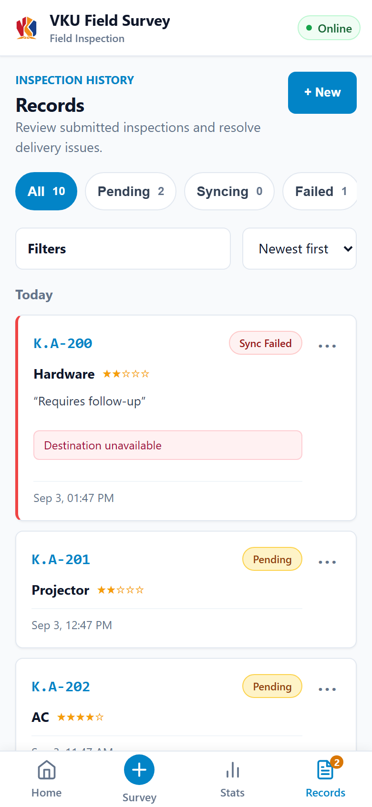
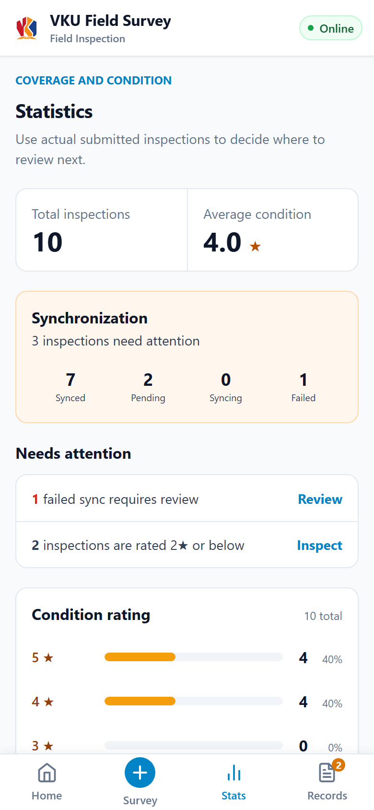
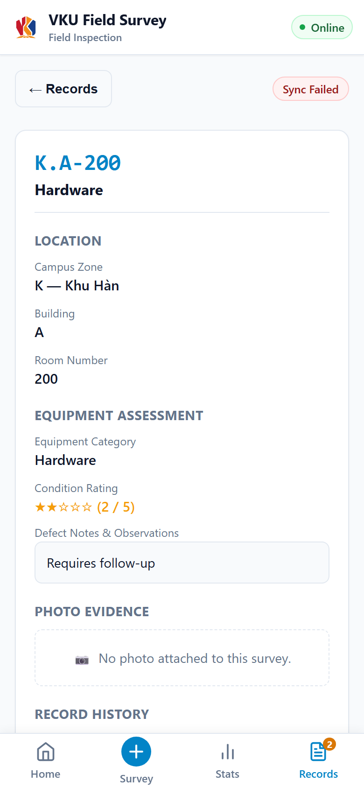

# BÁO CÁO KỸ THUẬT NGẮN MINI-PROJECT

**Học phần:** Phát triển ứng dụng di động đa nền tảng (VKU)  
**Tên Mini-Project:** Mini-Project 1 — VKU Field Survey  
**Sinh viên:** Nguyễn Văn Hoàng  
**Mã sinh viên:** 23IT088  
**Ngày nộp:** 03/09/2026

---

## Tóm tắt kết quả đạt được và khó khăn

VKU Field Survey đã hoàn thiện các chức năng khảo sát thiết bị, lưu dữ liệu ngoại tuyến, tự động đồng bộ, quản lý bản ghi, thống kê và đóng gói Android bằng Capacitor. Khó khăn chính là bảo vệ dữ liệu khi mất mạng và tránh đánh dấu đồng bộ thành công sai. Giải pháp là lưu nháp cùng hàng đợi vào IndexedDB, xử lý tuần tự và chỉ chuyển bản ghi sang `SYNCED` khi máy chủ xác nhận. Qua dự án, em hiểu rõ hơn về thiết kế offline-first, PWA và việc tách biệt giao diện, nghiệp vụ, lưu trữ và API nền tảng.

---

## 1. THÔNG TIN CHUNG VÀ LIÊN KẾT SẢN PHẨM

- **Sinh viên:** Nguyễn Văn Hoàng — **MSSV:** 23IT088
- **Vai trò:** Phân tích, thiết kế, phát triển và kiểm thử ứng dụng
- **Demo trực tuyến:** [https://vkufieldsurvey.vanhoang.online](https://vkufieldsurvey.vanhoang.online/)
- **Tải file cài đặt APK:** [https://vkufieldsurvey.vanhoang.online/downloads/vku-field-survey.apk](https://vkufieldsurvey.vanhoang.online/downloads/vku-field-survey.apk)
- **GitHub:** [https://github.com/Vcoch27/vku-field-survey](https://github.com/Vcoch27/vku-field-survey)
- **Video demo:** [https://www.youtube.com/shorts/CLNMuCuIisI](https://www.youtube.com/shorts/CLNMuCuIisI)

---

## 2. DANH SÁCH CHỨC NĂNG ĐÃ TRIỂN KHAI

| STT | Chức năng | Trạng thái | Nội dung triển khai |
| :---: | --- | :---: | --- |
| 1 | Giao diện khảo sát responsive | ✅ Hoàn thành | Tối ưu cho điện thoại và máy tính; hỗ trợ nhập địa điểm, danh mục, đánh giá 1–5 sao, ghi chú và ảnh. |
| 2 | PWA cài đặt độc lập | ✅ Hoàn thành | Có manifest, Service Worker, App Shell và hỗ trợ khởi động lại khi ngoại tuyến. |
| 3 | Lưu dữ liệu ngoại tuyến | ✅ Hoàn thành | Tự động lưu bản nháp, ảnh và bản ghi chờ đồng bộ bằng IndexedDB thông qua thư viện `idb`. |
| 4 | Đồng bộ tự động | ✅ Hoàn thành | Xử lý hàng đợi tuần tự khi có mạng; chỉ xác nhận `SYNCED` sau phản hồi thành công từ máy chủ. |
| 5 | Quản lý bản ghi và thống kê | ✅ Hoàn thành | Xem chi tiết, lọc bản ghi, theo dõi trạng thái và thống kê theo đánh giá, danh mục, khu vực. |
| 6 | Ứng dụng Android | ✅ Hoàn thành | Đóng gói bằng Capacitor, tích hợp Camera và Network; APK debug đã build và cài đặt thành công. |

---

## 3. KIẾN TRÚC KỸ THUẬT VÀ CẤU TRÚC DỰ ÁN

Ứng dụng sử dụng React, TypeScript và Vite. Mã nguồn được chia thành các lớp rõ ràng:

- `src/features`: các màn hình Home, Survey, Records và Statistics.
- `src/domain`: mô hình dữ liệu, kiểm tra hợp lệ và nghiệp vụ đồng bộ.
- `src/data`: lưu trữ IndexedDB.
- `src/platform`: adapter cho PWA, Camera, Network và Google Sheets.
- `android`: dự án Android được đóng gói bằng Capacitor.

Dữ liệu khảo sát được lưu cục bộ trước, sau đó đưa vào hàng đợi bền vững và gửi tuần tự tới Google Sheets thông qua Google Apps Script. Khi xảy ra lỗi hoặc mất mạng, dữ liệu vẫn được giữ lại để thử lại.

---

## 4. MINH CHỨNG THỰC NGHIỆM VÀ ẢNH CHỤP

### Trang chủ và tổng quan công việc

### Danh sách và bộ lọc bản ghi

### Thống kê khảo sát

### Chi tiết bản ghi

Ứng dụng đã được kiểm tra tại các độ rộng từ 320px đến 1280px. Bộ kiểm thử tự động đạt **179 bài kiểm thử trên 31 file**; production build, PWA offline reload, Capacitor sync, Android build và cài đặt APK đều hoàn thành thành công.

---

## 5. KHÓ KHĂN KỸ THUẬT VÀ CÁCH GIẢI QUYẾT

### Bảo vệ dữ liệu khi mất mạng

Nếu chỉ gửi trực tiếp lên máy chủ, khảo sát có thể bị mất khi kết nối gián đoạn. Ứng dụng giải quyết bằng cách tự động lưu bản nháp và hàng đợi gửi trong IndexedDB. Khi mạng trở lại, hệ thống tiếp tục xử lý các bản ghi theo thứ tự.

### Xác định đúng trạng thái đồng bộ

Thiết bị báo có mạng không có nghĩa máy chủ đã nhận dữ liệu. Vì vậy, ứng dụng chỉ chuyển bản ghi sang `SYNCED` sau khi nhận xác nhận hợp lệ từ Google Apps Script. Các lần gửi thất bại vẫn giữ nguyên dữ liệu để người dùng thử lại.

**Bài học kinh nghiệm:** Một ứng dụng offline-first cần phân biệt rõ trạng thái kết nối, lưu trữ cục bộ và xác nhận của máy chủ. Kiểm thử tình huống lỗi, nhiều kích thước màn hình và thiết bị thật quan trọng không kém việc phát triển chức năng chính.
